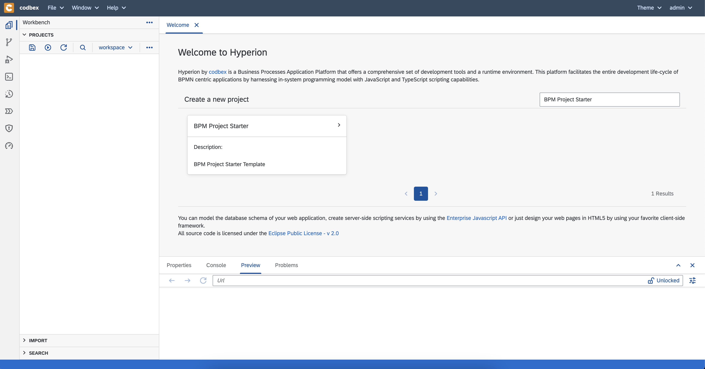
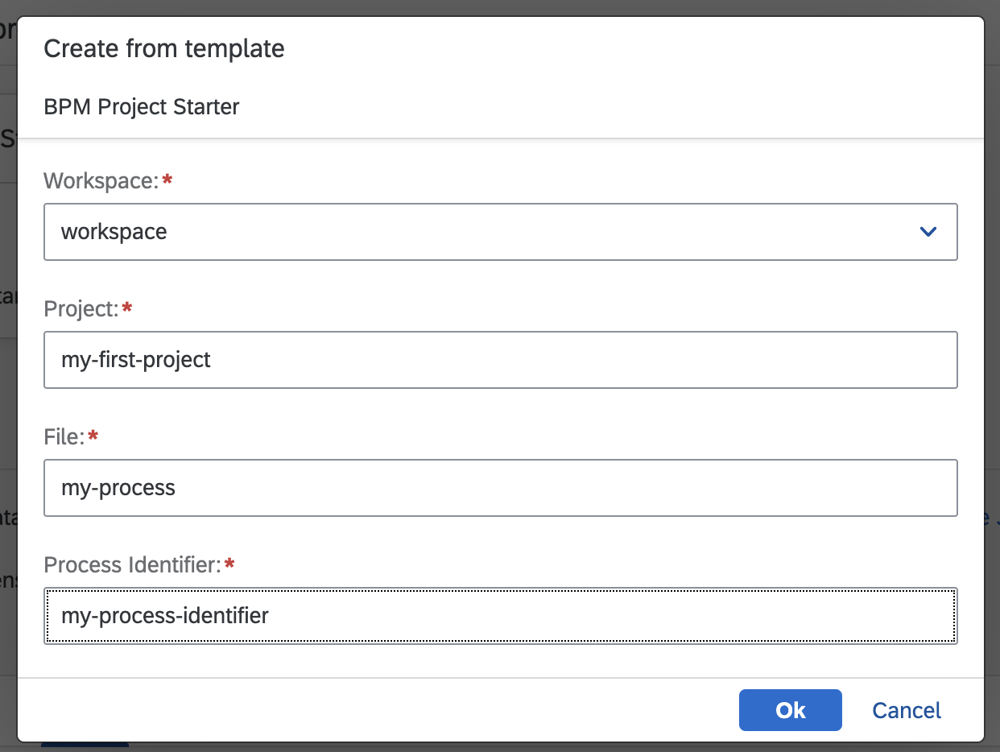
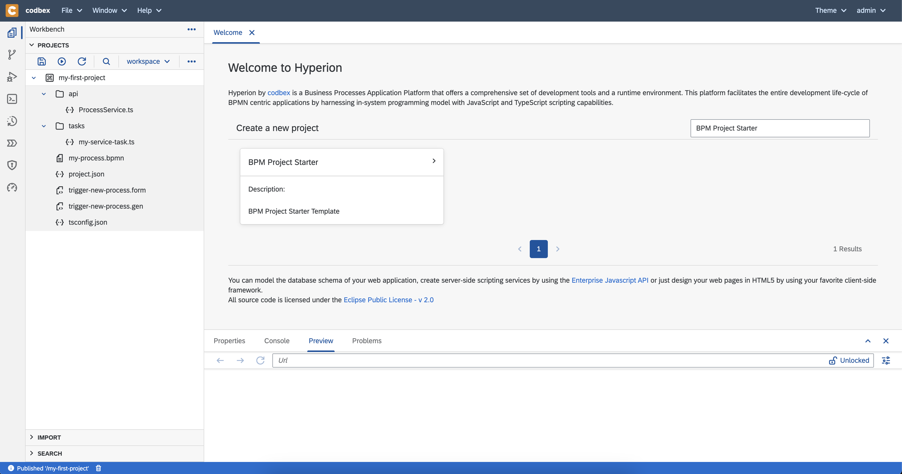
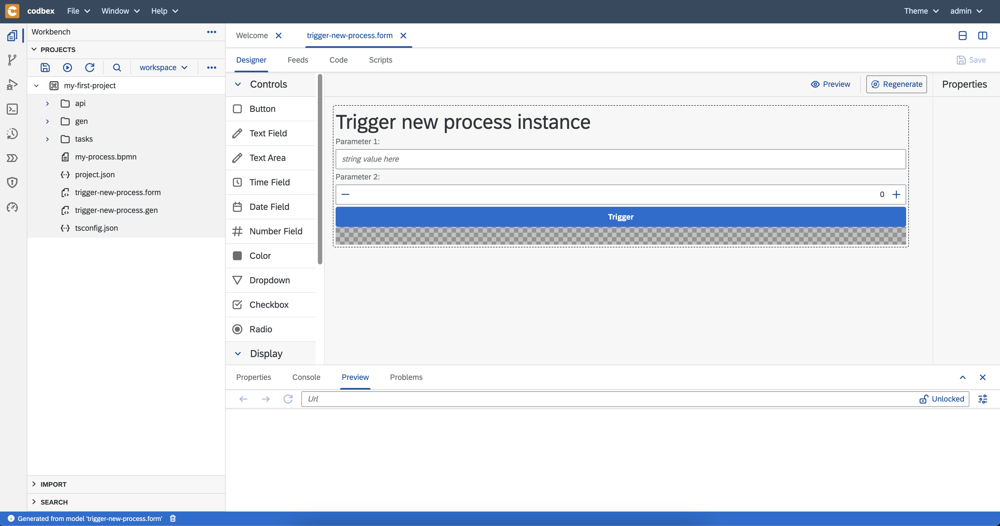
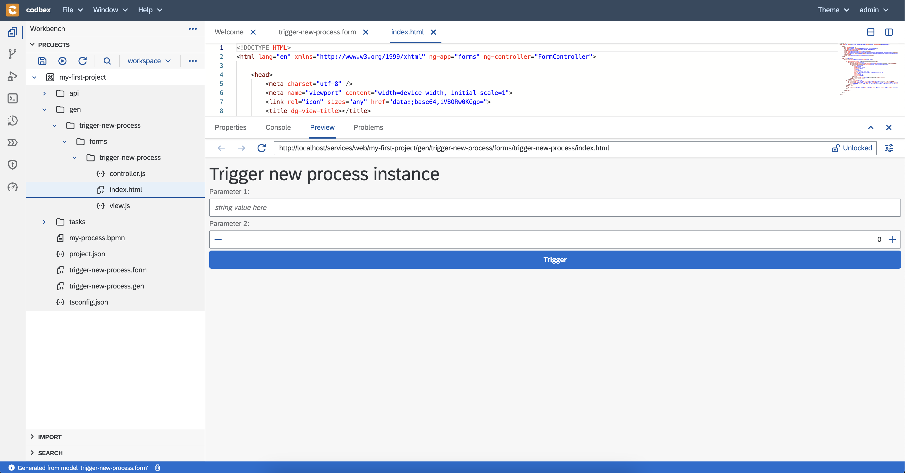
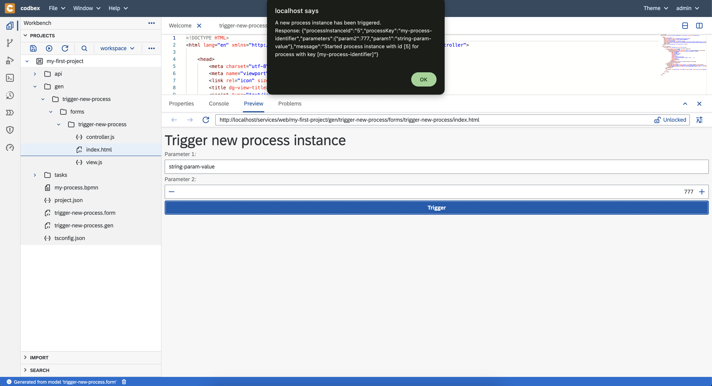

# codbex-hyperion

Hyperion Edition provides the Business Processes modeling, management and operation components.

It is good for exploration BPMN scenarios based on Flowable framework.

## Get Started

### Build and Run

#### Java

- Build the project<br>
  ```
  mvn clean install
  ```
- Start the application<br>
  ```
  java -jar application/target/codbex-hyperion-application-*.jar
  ```
  __Note:__ to start the application in debug
  ```
  java -agentlib:jdwp=transport=dt_socket,server=y,suspend=n,address=8000 -jar application/target/codbex-hyperion-application-*.jar
  ```

You can use on e of the following maven profiles to do different tasks<br>

| Profile Name      | Description                                                          |
|-------------------|----------------------------------------------------------------------|
| tests             | Run unit and integration tests                                       |
| unit-tests        | Run unit tests                                                       |
| integration-tests | Run integration tests                                                |
| quick-build       | Build project skipping tests, javadoc, licensing and code formatting |
| format            | Format the code                                                      |

To activate a profile, add it to the maven command.<br>Example:

```
mvn clean install -P quick-build
```

#### Docker

Alternatively, you can start the application using a Docker image

```
IMAGE_VERSION='latest'
docker run --name codbex-hyperion --rm -p 80:80 \
    ghcr.io/codbex/codbex-hyperion:$IMAGE_VERSION
```

If you want persistent workspace and database with the default configuration, you can attach a folder to the image

```
HYPERION_WORKSPACE_DIR='/tmp/hyperion'
IMAGE_VERSION='latest'

docker run --name codbex-hyperion --rm -p 80:80 \
  -v "$HYPERION_WORKSPACE_DIR:/target/dirigible" \
  ghcr.io/codbex/codbex-hyperion:$IMAGE_VERSION
```

#### Access the application

To access the application open [http://localhost:80](http://localhost:80).
Use the default credentials to login. User `admin` and password `admin`.

#### REST API

You can find all available REST APIs
at [http://localhost:80/swagger-ui/index.html](http://localhost:80/swagger-ui/index.html)

### Quick start

To quickly create a new project, follow the steps bellow:

- Start the application by following the steps in [Build and Run](#build-and-run)
- Select `BPM Project Starter` template from the `Welcome` view
  
- add the required template params
  
- Click on `Ok` button
- Your first project is generated
  
- Generate a form for process triggering
    - Open `trigger-new-process.form` file
    - Click on `Regenerate` button
      
- Now you can test your first process
    - Refresh the workspace by clicking on `Refresh` button
    - Navigate to generated form and open the `Preview` tab
      
    - Add process params and click on `Trigger` button
      
    - Now, your process is triggered
    - You can check the logs for a message from the default process service task
      
- Next steps are to modify the process as you wish
  
      
